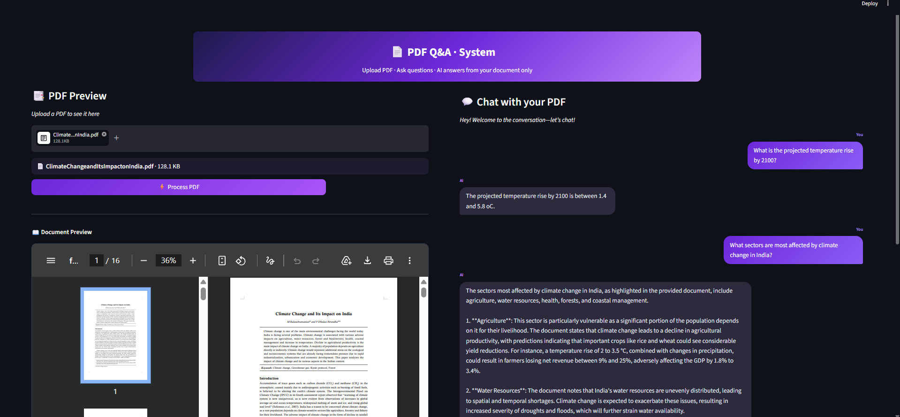

# 📄 PDF Q&A System (RAG-based)

An intelligent **PDF Question-Answering system** that allows users to upload a PDF and ask questions based on its content. The system uses **Retrieval-Augmented Generation (RAG)** with embeddings and vector search to provide accurate, context-aware answers.

---
## 🌐 Live Application
You can view deployed web app here:  
👉 [Open App](https://adyfi-intern-project-pdf-qna.streamlit.app/)

